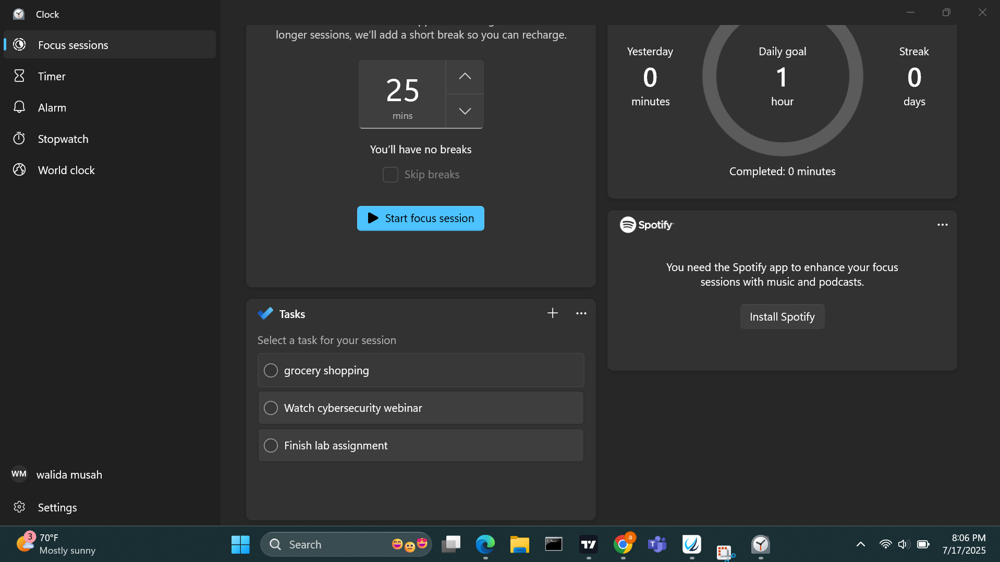

# 🧠 FocusFlow: Building a Personal Task Management System

This project documents how I created and tested a simple **task management system** using a fictional web app called **FocusFlow**. The purpose of this app is to help individuals manage daily tasks, track progress, and improve productivity using a clean and minimal interface.

---

## ✅ Step 4: Creating the Markdown File on GitHub

### 🛠️ GitHub Setup

- Registered a GitHub account at [https://github.com](https://github.com)
- Created a new repository named `focusflow-productivity`
- Created this file named `task-manager-report.md`
- Used Markdown features like:
  - Headings (`#`, `##`)
  - Lists (`-`, `*`)
  - Tables
  - Images (``)
  - Blockquotes
  - Code blocks

---

## 🧩 Project Overview

**FocusFlow** is a personal productivity web application that allows users to:

- Create to-do lists
- Set deadlines
- Track completed tasks
- Get reminders via email
- View weekly productivity charts

> The goal of this project was to simulate how a user could use such an app to improve time management and daily discipline.

---

## 🖥️ Step-by-Step Setup

### 1️⃣ User Registration and Dashboard Access

- Visited `https://focusflow.example.com`
- Registered with my email: `abiba@example.com`
- Created a personal workspace called **"Abiba's Planner"**

---

### 2️⃣ Creating and Organizing Tasks

Used the app to add my tasks for the week:

#### 🔹 Weekly Task List

| Task                          | Deadline       | Priority | Status     |
|-------------------------------|----------------|----------|------------|
| Finish Lab Assignment         | July 18, 2025  | High     | ✅ Done     |
| Watch Cybersecurity Webinar   | July 20, 2025  | Medium   | ⏳ Pending  |
| Grocery Shopping              | July 21, 2025  | Low      | ⏳ Pending  |



---

### 3️⃣ Enabling Reminders and Notifications

- Enabled daily task reminders at 8:00 AM
- Turned on weekly productivity summary emails
- Allowed browser push notifications

📧 **Reminder Example:**

```text
Good morning, Abiba!  
Here's your task list for today:
- Finish Lab Assignment
- Review Module 3 Notes

Stay focused! 🚀
