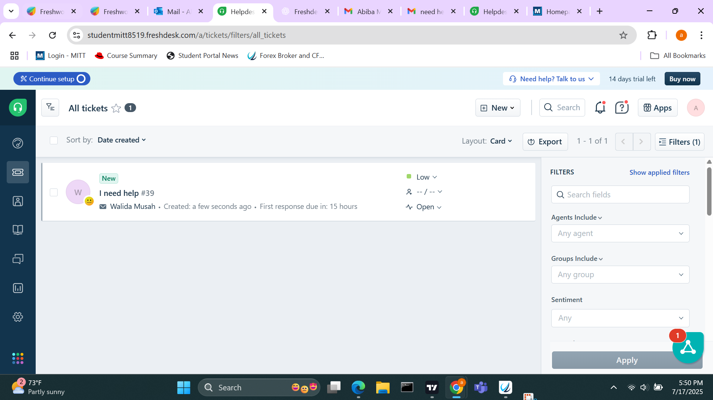
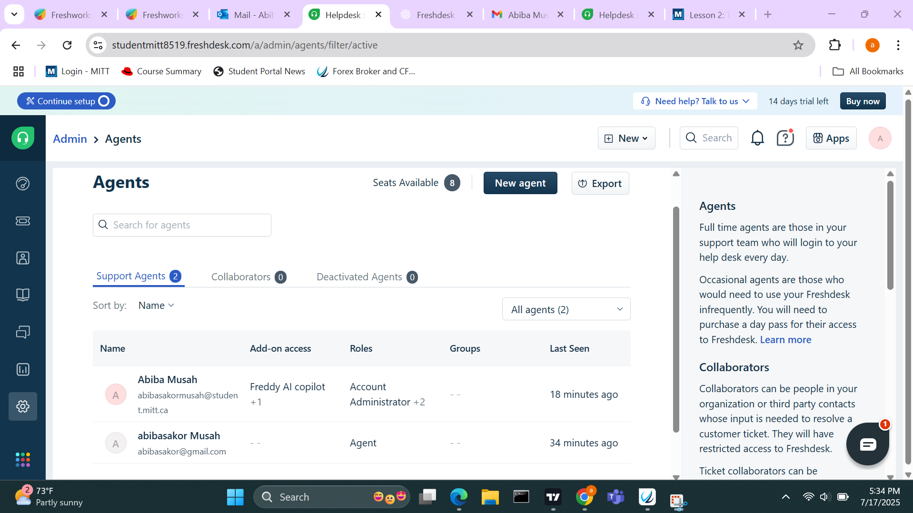
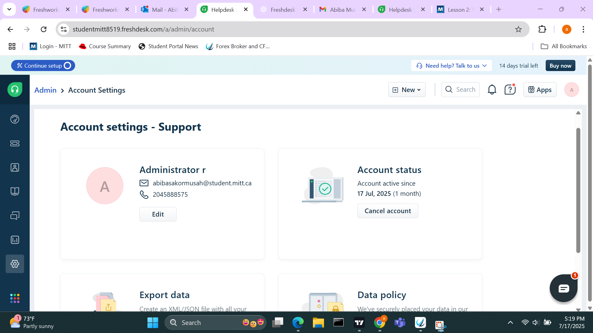
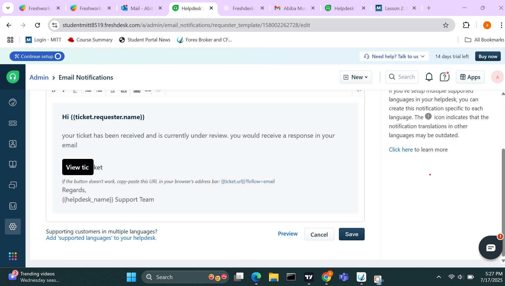
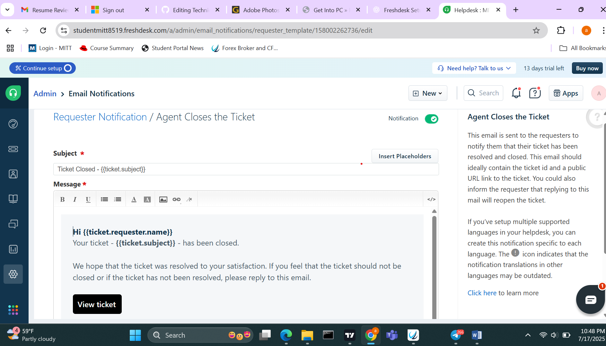
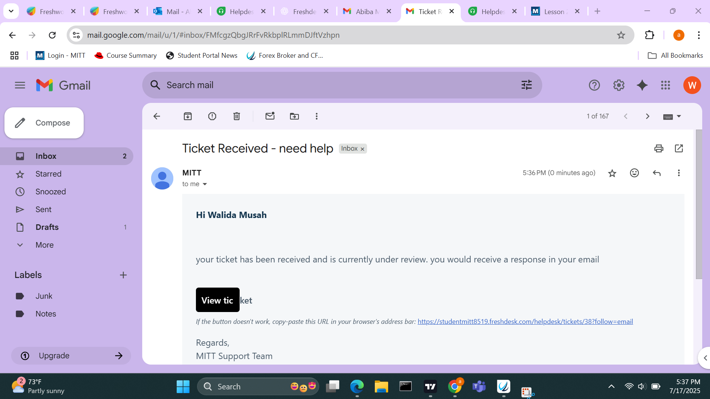
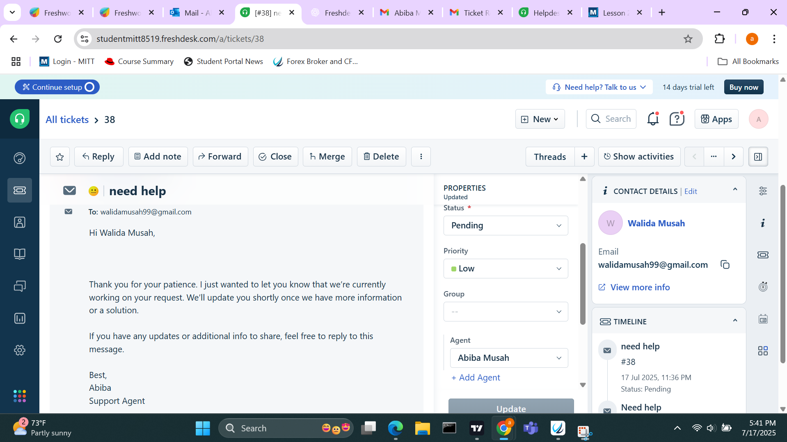
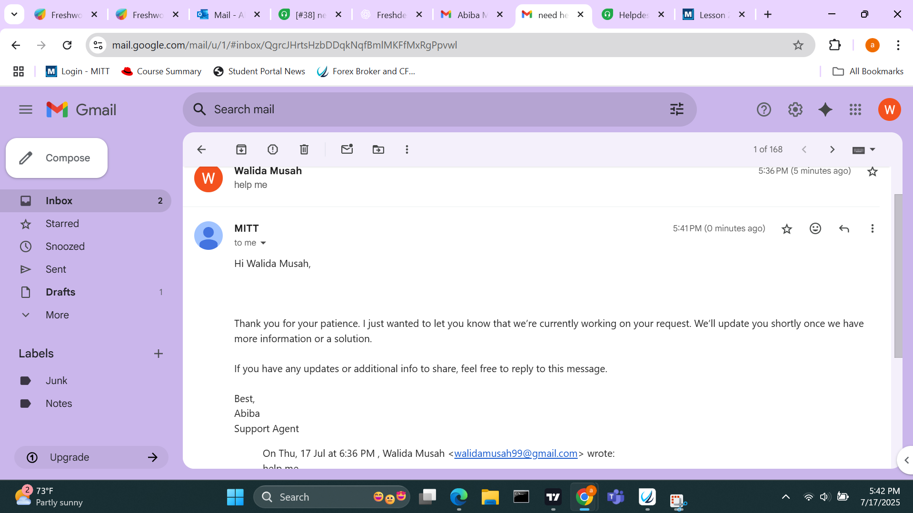
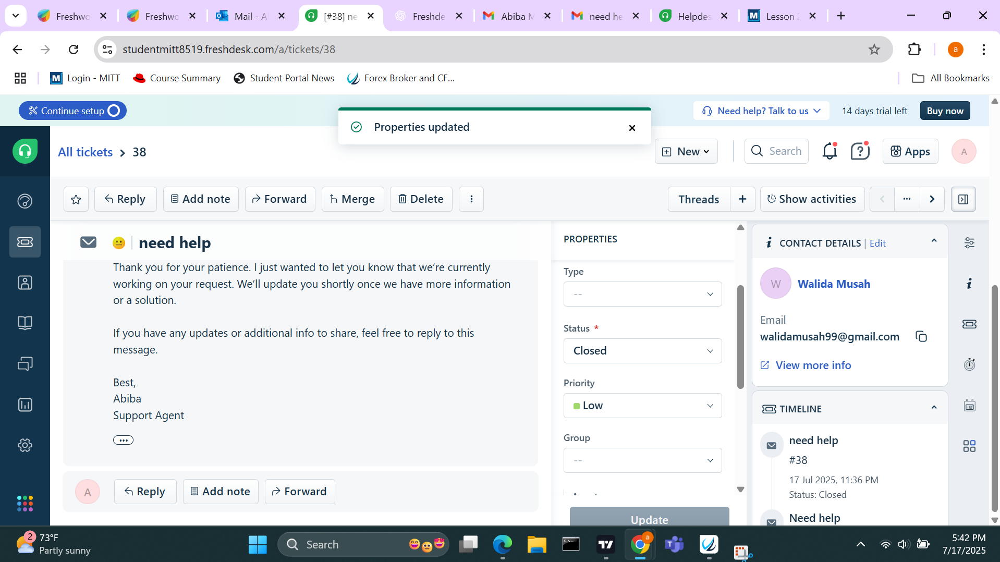
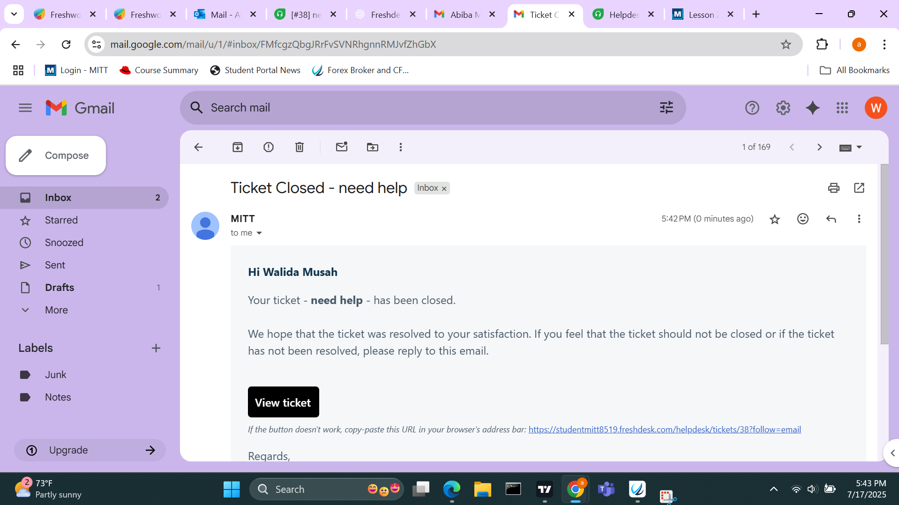

# Lesson 2: Ticket System Research & Creating Your Own "Help Desk"

## Part 1: Freshworks Account Creation & User Setup

### Step 1: Create a Freshdesk Account
- Signed up on Freshdesk and explored the dashboard.

### Step 2: Activated Support Email Address  
Screenshot:  
   

### Step 3: Added a New Agent  
Screenshot:  

### Step 4: Changed Admin Account Name  
Screenshot:  

---

## Part 2: Configure Automated Responses

### Step 1: Enabled Notification for "New Ticket Created"
### Step 2: Automatic Reply for New Tickets  
Screenshot:  

### Step 3: Personalized Message for Auto-Reply  
Screenshot:  

### Step 4: Enabled "Ticket Closed" Notification  
### Step 5: Custom Closed Ticket Response  
Screenshot:  

## Part 3: Test Automated Responses

### Step 1: Sent a Test Ticket  
Screenshot:  

### Step 2: Updated Ticket Status to Pending  
Screenshot:  

### Step 3: Responded to the Client  
Screenshot:  

### Step 4: Closed the Ticket  
Screenshot:  

### Step 5: Confirmed Email Receipt  
Screenshot:  

---
## Table of Contents

| Section                  | Status   |
|--------------------------|----------|
| Freshdesk Setup          | ✅ Done  |
| Support Email Activation | ✅ Done  |
| Agent Configuration      | ✅ Done  |
| Auto-Reply Setup         | ✅ Done  |
| Ticket Testing           | ✅ Done  |

