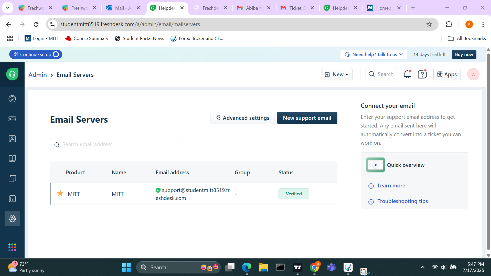

# Lesson 2: Ticket System Research & Creating Your Own "Help Desk"

## 👣 Part 1: Freshworks Account Creation & User Setup

### ✅ Step 1: Create a Freshdesk Account
- Signed up on Freshdesk and explored the dashboard.

### ✅ Step 2: Activated Support Email Address  
📷 Screenshot:  

### ✅ Step 3: Added a New Agent  
📷 Screenshot:  

### ✅ Step 4: Changed Admin Account Name  
📷 Screenshot:  

---

## 🛠️ Part 2: Configure Automated Responses

### ✅ Step 1: Enabled Notification for "New Ticket Created"
📷 Screenshot:  

### ✅ Step 2: Automatic Reply for New Tickets  
📷 Screenshot:  

### ✅ Step 3: Personalized Message for Auto-Reply  
📷 Screenshot:  

**Message Sample:**
> Hello! 👋  
> We've received your support request and assigned it to one of our agents. We'll get back to you shortly. Thank you for contacting us!

### ✅ Step 4: Enabled "Ticket Closed" Notification  
📷 Screenshot:  

### ✅ Step 5: Custom Closed Ticket Response  
📷 Screenshot:  

**Message Sample:**
> Hi there! 🎉  
> Your support ticket has been successfully closed. If you have any other issues, feel free to reach out again. Have a great day!

---

## 🧪 Part 3: Test Automated Responses

### ✅ Step 1: Sent a Test Ticket  
📷 Screenshot:  

### ✅ Step 2: Updated Ticket Status to Pending  
📷 Screenshot:  

### ✅ Step 3: Responded to the Client  
📷 Screenshot:  

### ✅ Step 4: Closed the Ticket  
📷 Screenshot:  

### ✅ Step 5: Confirmed Email Receipt  
📷 Screenshot:  

---

## ✅ Summary

| Section                  | Status   |
|--------------------------|----------|
| Freshdesk Setup          | ✅ Done  |
| Support Email Activation | ✅ Done  |
| Agent Configuration      | ✅ Done  |
| Auto-Reply Setup         | ✅ Done  |
| Ticket Testing           | ✅ Done  |

---

## 📌 Notes
- All screenshots are located in the `lab-pics/` folder.
- Markdown used to structure and style this lab submission.

