# Wiki.js Lab 6 – Exploring Wiki Docs Application  
**Student:** Abiba  
**Course:** NSA-590  

---

## Environment Setup

### PostgreSQL and Node.js Installation  
Verified that both PostgreSQL and Node.js are successfully installed before proceeding with Wiki.js setup.

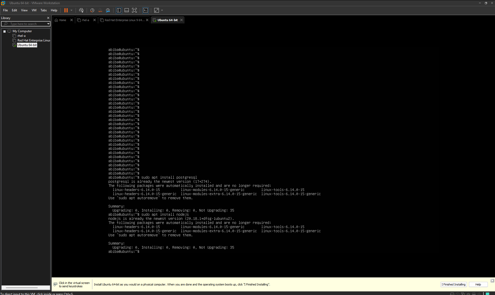
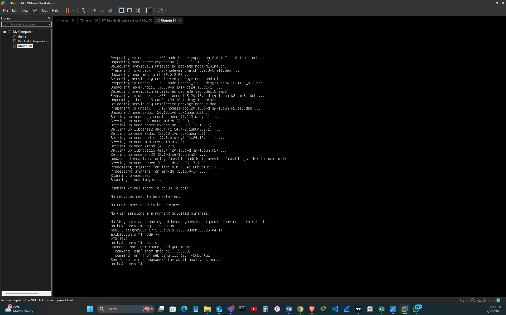

---

## Home Page

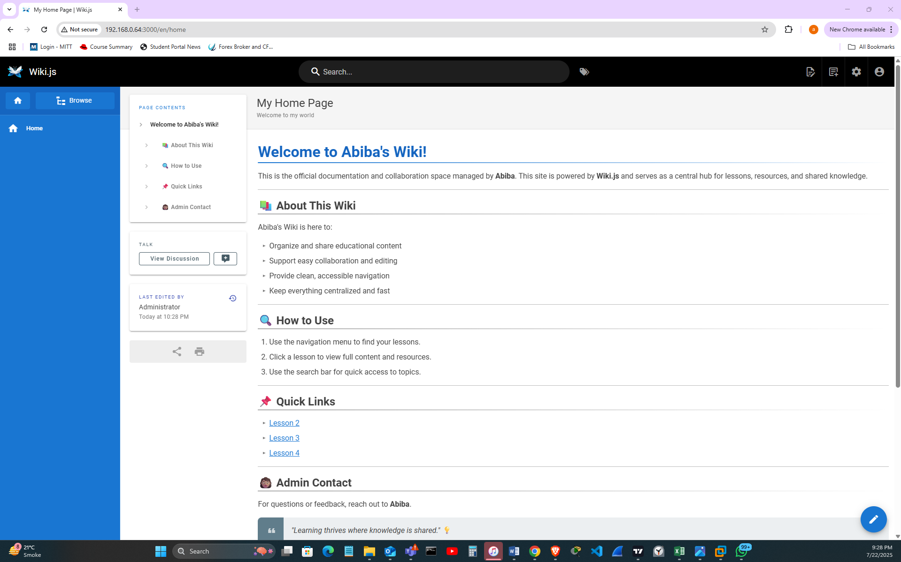

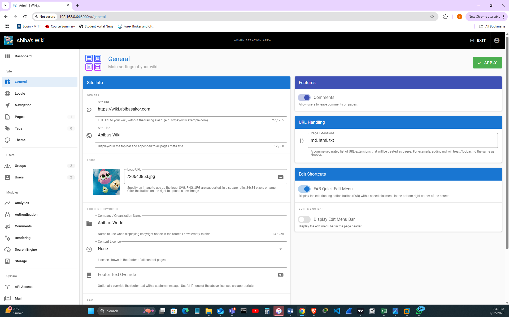

---

## Groups and Permissions

### Students Group  

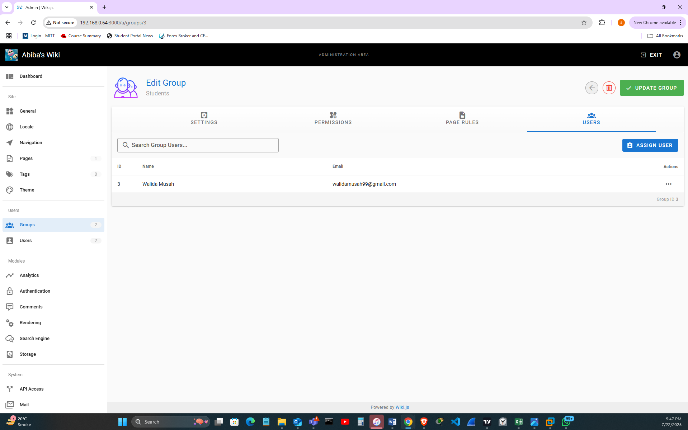

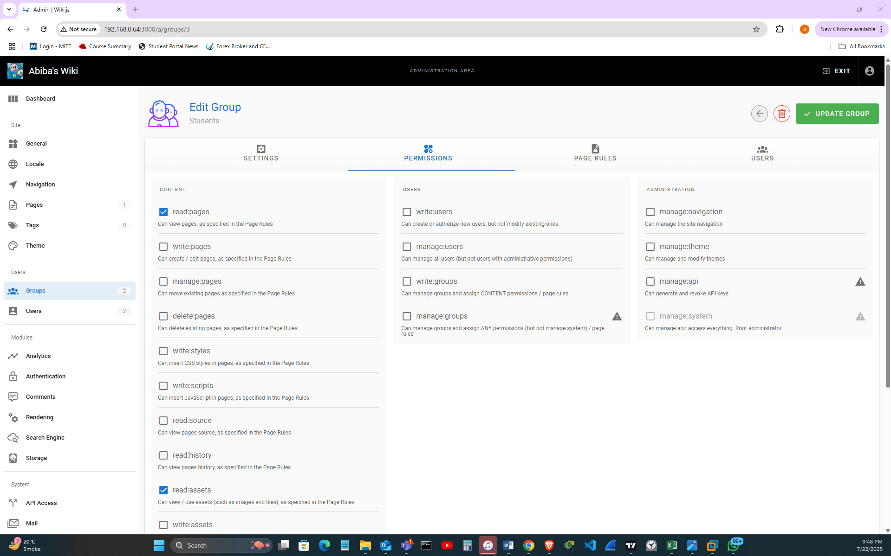

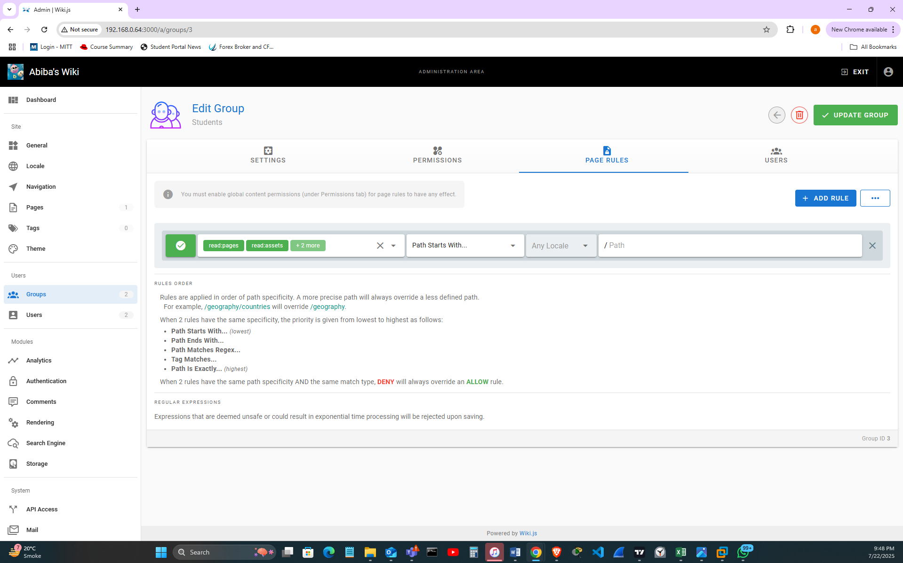

### Instructors Group  
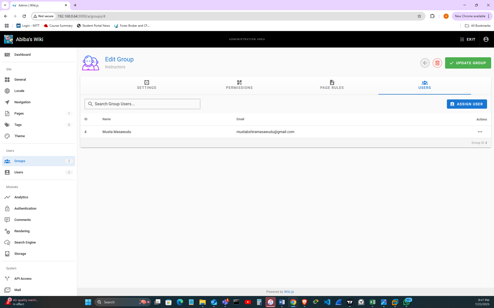

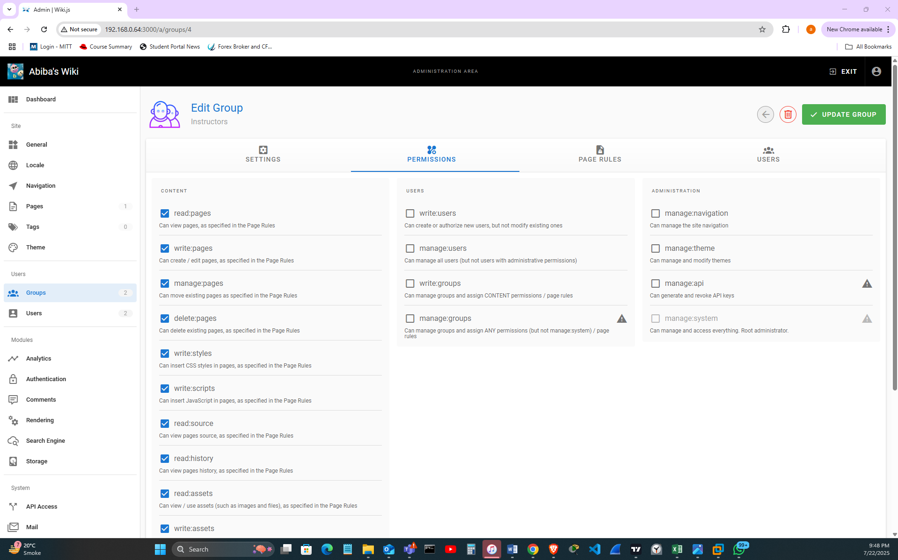

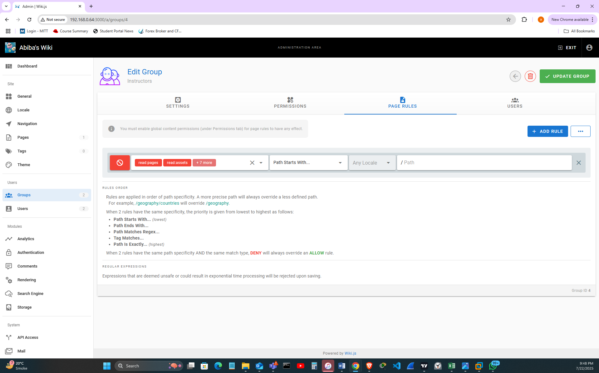

---

## Admin Group
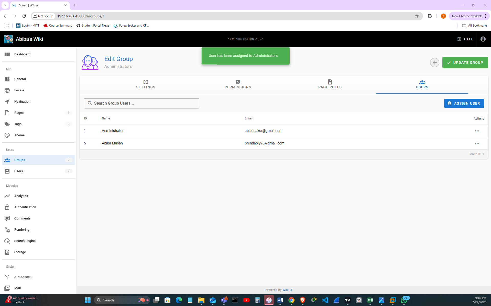

---

## Pages Created

### Lesson 2 – Importance of Technical Documentation  
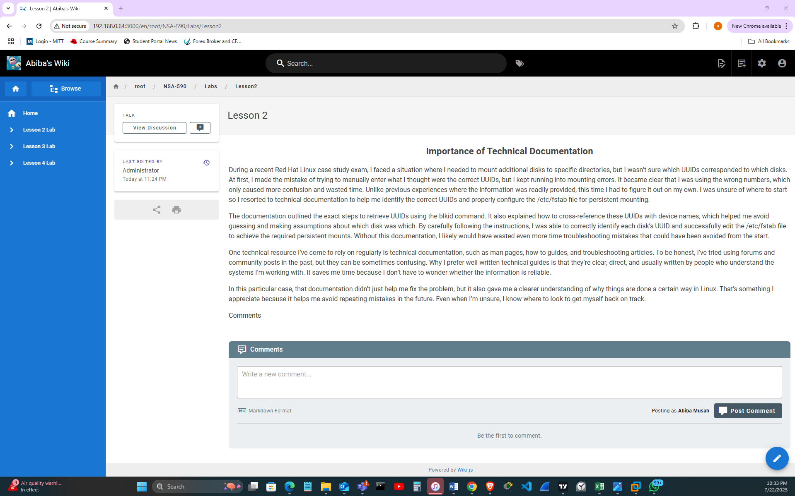

### Lesson 3 – SOP Documentation
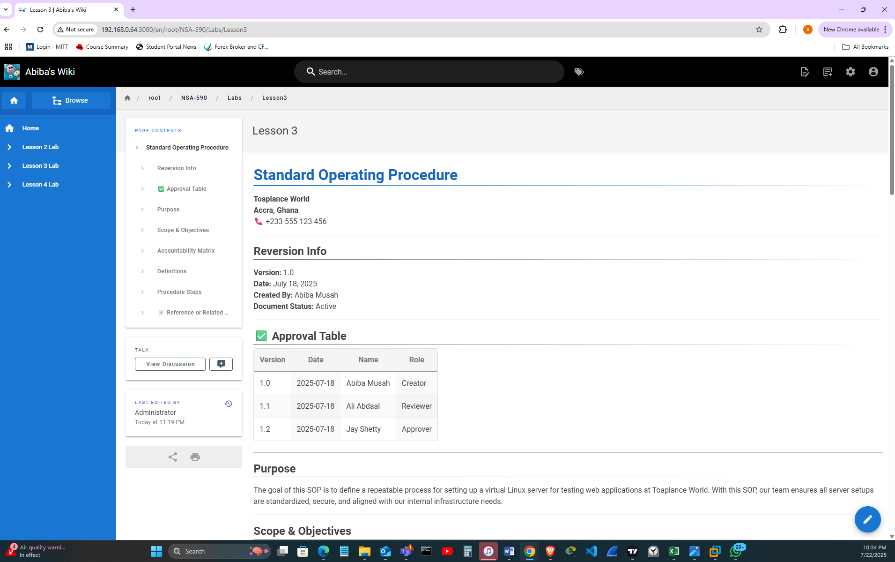

### Lesson 4 – RFP Documentation
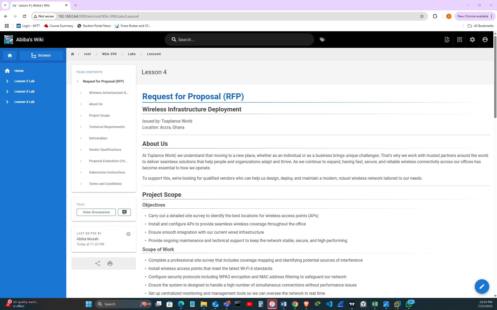
